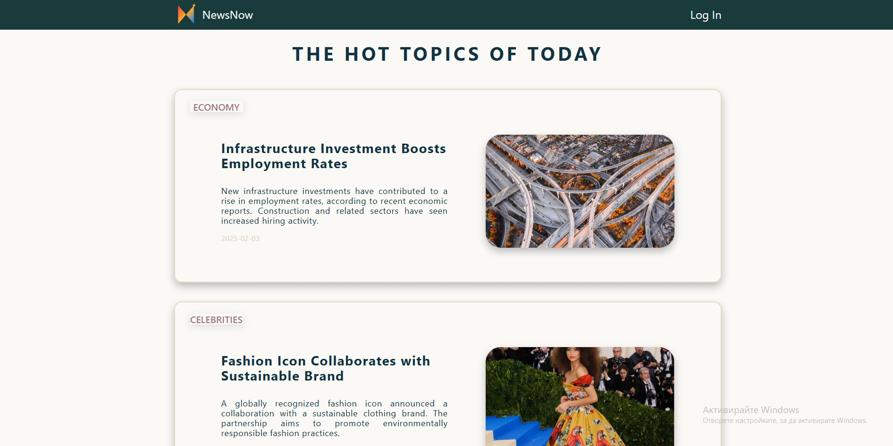
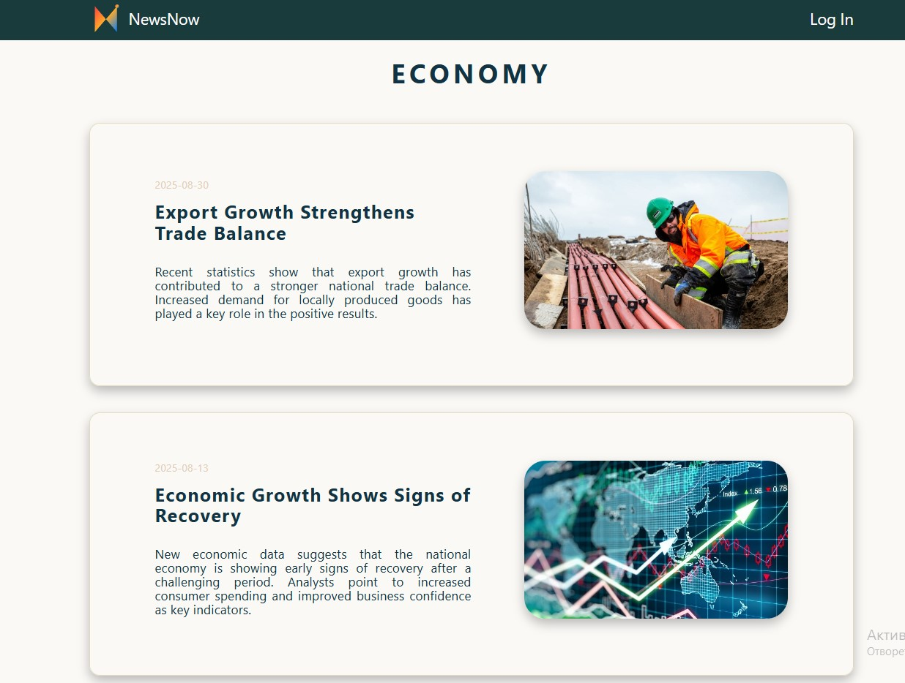
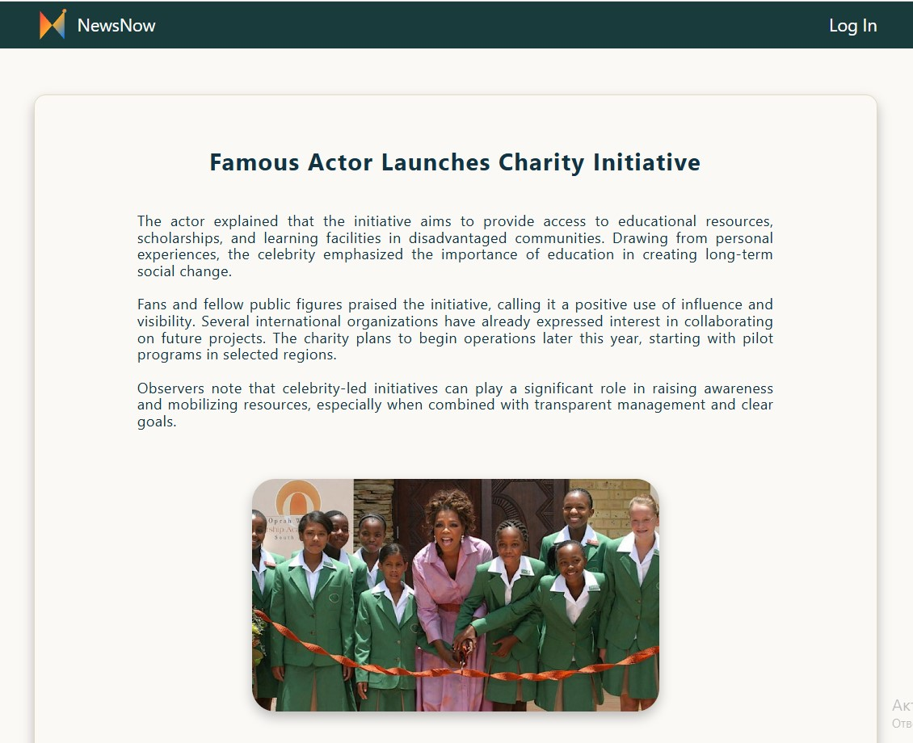
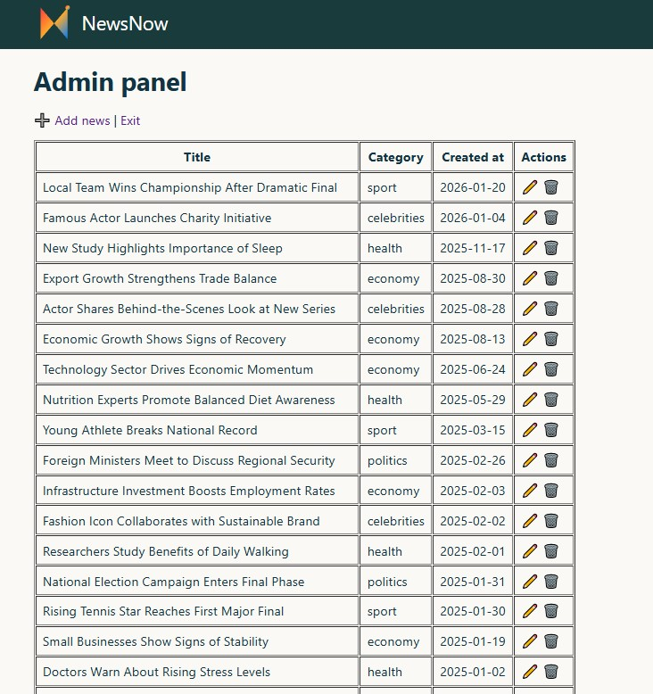
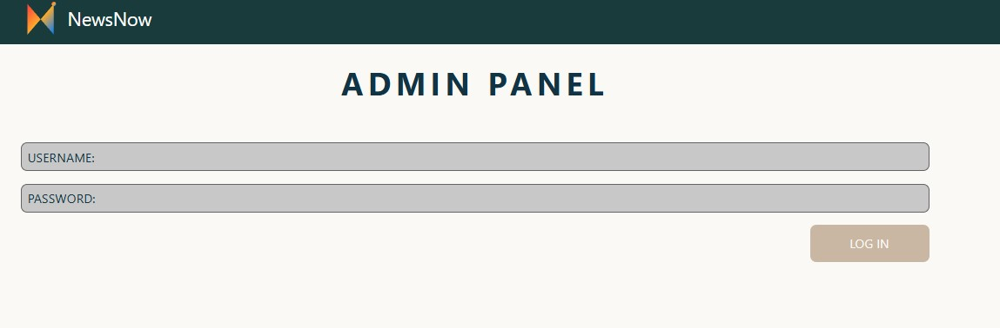
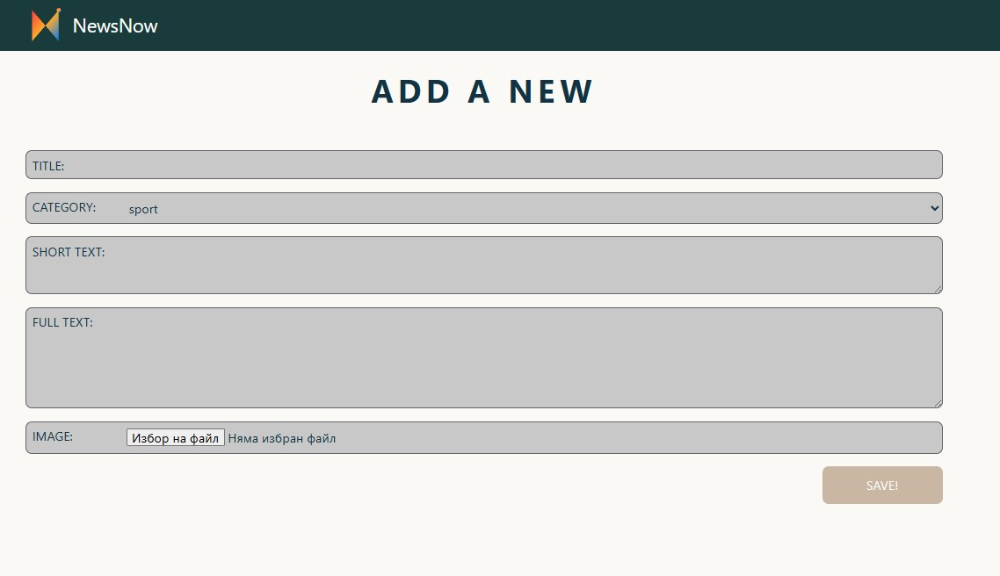

# NewsNow 📰

This is a news website built with PHP, HTML, and CSS, using MariaDB for data storage. Users can view the latest news, browse by category, and read individual articles. The site also has an admin section for managing news content.

# Features

- View the latest news from each category on the homepage

- Browse all news in a specific category

- Read individual news articles

- Admin section to manage content:

  + ➕ Add news

  + ➕ Edit news

  + ❌ Delete news

# The project design














# ⚙️ Installation

1. Clone the repository:

```git clone https://github.com/YoanaBorisova08/NewsNow.git```

2. Place the project in a local server environment (e.g., XAMPP, MAMP, or Laragon)
   
4. Create the database in MariaDB:

```CREATE DATABASE news_site_db;```

Create the news and users tables using the code below.

```
CREATE TABLE news (
    id INT(11) NOT NULL AUTO_INCREMENT,
    title VARCHAR(1000) CHARACTER SET utf8 COLLATE utf8_general_ci NOT NULL,
    category VARCHAR(100) CHARACTER SET utf8 COLLATE utf8_general_ci NOT NULL,
    short_text VARCHAR(1000) CHARACTER SET utf8 COLLATE utf8_general_ci NOT NULL,
    full_text TEXT CHARACTER SET utf8 COLLATE utf8_general_ci NOT NULL,
    photo VARCHAR(200) CHARACTER SET utf8 COLLATE utf8_general_ci DEFAULT NULL,
    created_at DATE NOT NULL,
    PRIMARY KEY (id)
);

CREATE TABLE users (
    id INT UNSIGNED AUTO_INCREMENT PRIMARY KEY,
    username VARCHAR(50) NOT NULL UNIQUE,
    password VARCHAR(255) NOT NULL
) 
```
4. Start your local server and open the website in your browser:

```http://localhost/news-site```

# 🛠️ Technologies Used

PHP – for dynamic content and admin functionality

HTML5 – structure of pages

CSS3 – styling and layout
